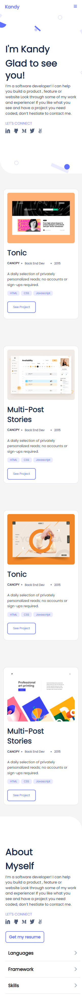
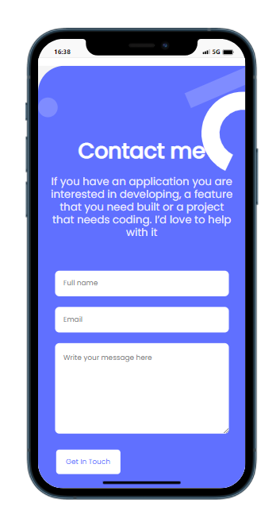
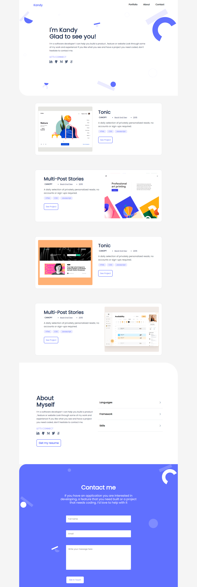

# My-portfolio

This is my portfolio

And the contact-form in phonr simulator

This si my desktop version

## Built With

- HTML
- CSS
- Figma

## Getting Started

To use this project and running it localy, follow the steps bellow:

### Prerequisites

clone repo: `git clone https://github.com/Kandy-Peter/My-portfolio.git`

###Live
 To see live project go to: [https://kandy-peter.github.io/My-portfolio/](https://kandy-peter.github.io/My-portfolio/)
### Install

 run `npm install` to install dependencies

## Command

These commands are here to help you for how to check errors in your code using Linter

*to install the webhint run `npm init -y` to initialize the package and create `package.json`

 then run `npm install --save-dev hint@6.x`
 After creating the `.hintrc` file, run `npx hint .` to ckeck if there's an error.

*to install the stylelint that help you to avoid errors in styles code run:
    `npm install --save-dev stylelint@13.x stylelint-scss@3.x stylelint-config-standard@21.x stylelint-csstree-validator@1.x`
 Then run `npx stylelint "**/*.{css,scss}"` after creating a `.stylelint.json` file

## Authors

👤 **Kandi Peter**

- GitHub: [Kandi-Peter](https://github.com/Kandy-Peter)
- LinkedIn: [Kandi-Kamuntu](https://www.linkedin.com/in/kandi-peter-a49590212/)
- twitter: [Kandi_Peter](https://twitter.com/peter_kandy)

## 🤝 Contributing

Contributions, issues, and feature requests are welcome!

Feel free to check the [issues page](../../issues/).

## Show your support

Give a ⭐️ if you like this project!

## Acknowledgments

- Hat tip to anyone whose code was used
- Inspiration
- etc

## 📝 License

This project is [MIT](./MIT.md) licensed.